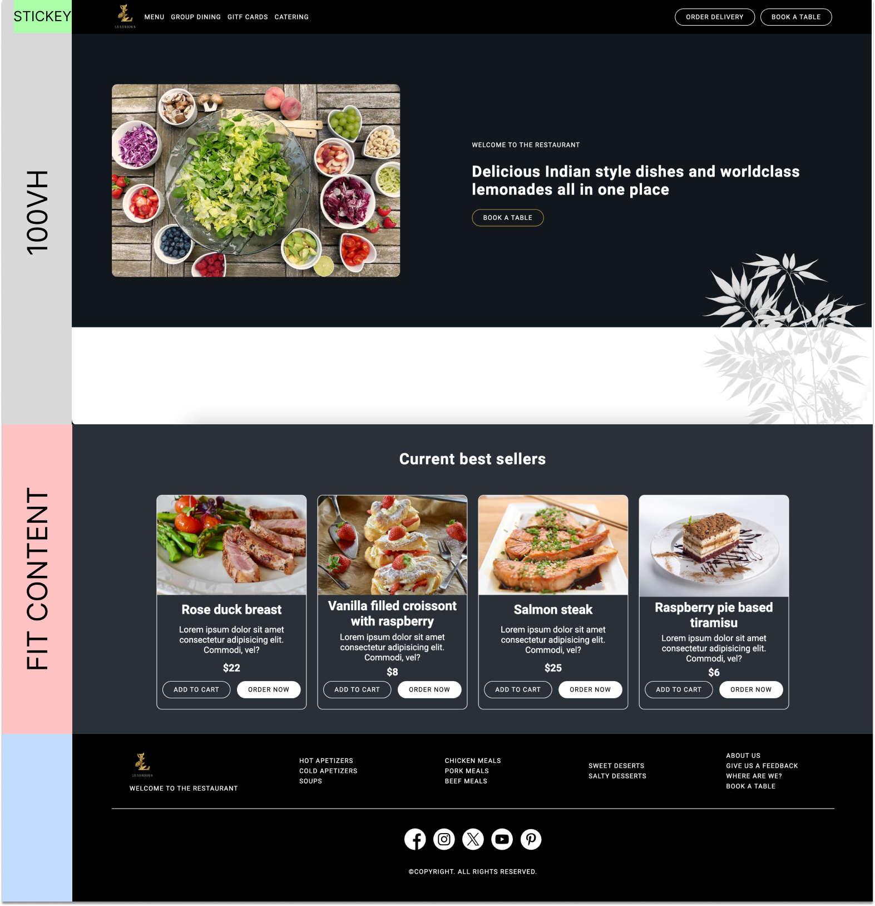
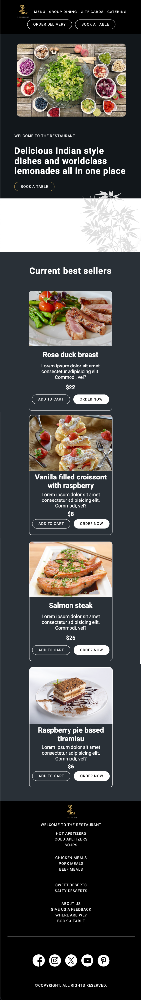

# HTML, CSS - Modulzáró

## Hova készítsem el a megoldásom?

1. Forkold ezt a repository-t a saját GitHub fiókod alá

1. Klónozd a forkolt repository-t a saját számítógépedre, ide készítsd el a megoldásod

1. Commit-olj rendszeresen (egy részegység befejeztével mindenképp legyen egy commit, pl.: html header, html section-01, css header stb, css section-01 stb.)

1. Push-olni csak akkor push-olj amikor az oktatók erre megkérnek, ez körülbelül az idő lejárta előtt 5 perccel lesz

1. Megoldásként csak az idő lejártát megelőző commit-okat tudjuk elfogadni, az utána érkező kódrészleteket figyelmen kívül hagyjuk

## Miben kérhetek segítséget?

- Alapvetően semmiben, egyedül kell dolgoznod, internetet természetesen használhatsz, de nem kérhetsz másoktól (csoporttárs, ismerős stb.) segítséget

- Az oktatók csak olyan kérdésekben tudnak segíteni, amiket ezen a ponton nem kell tudnod megoldani (pl.: eddig még nem látott git/github hibaüzenetek, nem működő funkciók a kódszerkesztőben), a megoldáshoz nem kérhetsz iránymutatást

- Az olyan kérdéseidet, melyek a feladat elkészítésével kapcsolatban merülnek fel, discordon tedd fel közös csatornán, előfordulhat hogy más is ugyan azon ponton nem tudja értelmezni a kapott feladatot

## Az oldalon felhasznált színek

- fekete
- fehér
- arany: #bb9951
- sötétszürke: #12171B
- világoszürke: #283037

## FONTOS!

- A footer-t KÖTELEZŐ grid-el megcsinálni,  ha nem megy csinálhatod bárhogy máshogy, de ez minimális pontlevonással jár

## Feladat

- Készítsd el az alábbi weblap desktop illetve mobil nézetét

    
    